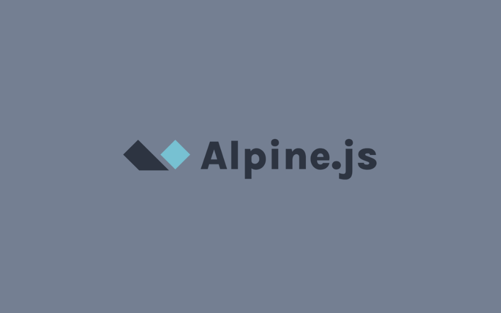

Cuando hablamos de frameworks de JavaScript, automáticamente pensamos en herramientas como React, Vue, Svelte o SolidJS. Estas herramientas son impresionantes y su popularidad sigue creciendo año tras año. Sin embargo, en proyectos de pequeño o mediano tamaño, donde no es necesario gestionar una aplicación compleja, optar por frameworks como React o Vue puede añadir un nivel de complejidad innecesario. 

Para estos casos, [Alpine.js](https://alpinejs.dev/) surge como una opción ideal. Diseñado para agregar interactividad rápidamente a páginas HTML con poca sobrecarga, Alpine permite introducir funcionalidades dinámicas sin tener que adoptar la arquitectura completa de un framework como React o Vue.

## ¿Qué es Alpine.js?

Alpine es un framework javascript que te permite agregar interactividad a páginas HTML sin mucho esfuerzo. Es muy ligero y no necesitas instalar ni configurar nada a diferencia de otros frameworks.

> Alpine es el jQuery para la web moderna.
>
><small>Así lo describe el propio autor de [Alpine.js](https://alpinejs.dev/)</small>

Para empezar a utilizar Alpine en tu proyecto, solo tienes que agregar la siguiente etiqueta script en el `<head>` de tu página HTML:

```html
<script defer src="https://cdn.jsdelivr.net/npm/alpinejs@3.x.x/dist/cdn.min.js"></script>
```

Esto agregará el código necesario para utilizar Alpine en tu proyecto.

## Cómo funciona?
Alpine funciona agregando atributos a tus elementos HTML. Estos atributos se llaman "directivas" y son utilizados para agregar funcionalidades dinámicas a tus páginas. 

Un script dice más que mil palabras, veamos un ejemplo:

```html
<div x-data="{open: false}">
    <button x-on:click="open = !open" class="bg-slate-700 hover:bg-slate-800 text-white py-2 px-4 rounded">Presiona aquí</button>
    <p x-show="open" x-transition class="bg-slate-100 p-4 rounded font-bold">Hola desde Alpine!!</p>
</div>
```

<div x-data="{open: false}">
    <button x-on:click="open = !open" class="bg-slate-700 hover:bg-slate-800 text-white py-2 px-4 rounded">Presiona aquí</button>
    <p x-cloak x-show="open" x-transition class="bg-slate-100 p-4 rounded font-bold">Hola desde Alpine!!</p>
</div>

### ¿Qué ha pasado aquí? 
El atributo `x-data` crea un componente Alpine, que básicamente es una forma de decirle a Alpine que maneje un pedazo de lógica en esa parte del HTML. Dentro de este componente, tenemos una variable llamada `open`. Con `x-on:click` le decimos que cuando hagamos clic en el botón, cambie el valor de `open` (si está en `true`, lo cambia a `false`, y viceversa). Luego, con `x-show`, controlamos si el párrafo se muestra o no, dependiendo de si `open` es `true`.

Además, `x-transition` brinda una animación de transición cuando cambiamos el valor de `open`. Esto hace que el párrafo se muestre y oculte de manera fluida. 

Todos los elementos que utilicen una variable de estado, también serán afectados con la modificación de esta variable. 

Veamos otro ejemplo:

```html
<div x-data="{open: false}">
    <button x-on:click="open = !open" class="bg-slate-700 hover:bg-slate-800 text-white py-2 px-4 rounded">Presiona aquí</button>
    <p x-text="open ? 'Mostrando el contenido' : 'Ocultando el contenido'" class="font-bold"></p>
    <p x-show="open" x-transition class="bg-slate-100 p-4 rounded font-bold">Hola desde Alpine!!</p>
</div>
```

<div x-data="{open: false}">
    <button x-on:click="open = !open" class="bg-slate-700 hover:bg-slate-800 text-white py-2 px-4 rounded">Presiona aquí</button>
    <p x-text="open ? 'Mostrando el contenido' : 'Ocultando el contenido'" class="font-bold"></p>
    <p x-cloak x-show="open" x-transition class="bg-slate-100 p-4 rounded font-bold">Hola desde Alpine!!</p>
</div>

En este ejemplo agregamos un nuevo elemento `<p>` con la directiva `x-text`. Esta directiva permite colocar texto a un elemento como resultado de una expresión. Al depender de la variable de estado `open`, la directiva `x-text` se actualizará automáticamente cuando cambie de valor. 

## Casos de uso de Alpine.js

Alpine es una opción ideal cuando tienes proyectos en marcha (como una aplicación backend como Laravel o Django por ejemplo) y quieres agregar interactividad (modales, toggles, validación de formularios) sin refactorizar todo el frontend.

Uno de sus usos están en simples sitios web estáticos, como páginas de blog o portfolios o aplicaciones renderizadas del lado del servidor como Laravel u otro framework backend. 

En el caso de Laravel, Alpine es una gran opción junto a [Livewire](https://livewire.laravel.com) para crear proyectos muy completos y rápidos.

<div class="important-content">Es importante mencionar que Alpine es un complemento más no un reemplazo. No está diseñado para SPAs o UIs muy complejas.
</div>

Otro buen caso de uso sería para reemplazar jQuery en proyectos y mantener toda la misma funcionalidad, pero con una sintaxis más simple y menos peso.

## ¿Es Alpine lo que necesitas?

Espero que esta introducción te haya servido de ayuda para entender cómo funciona Alpine.js y cómo podrías utilizarlo en tus proyectos. La documentación oficial de Alpine es muy completa y puedes encontrarla [aquí](https://alpinejs.dev/directives).

Si tienes alguna pregunta o deseas colaborar conmigo, no dudes en [contactarme](mailto:oscarmolinar96@gmail.com).